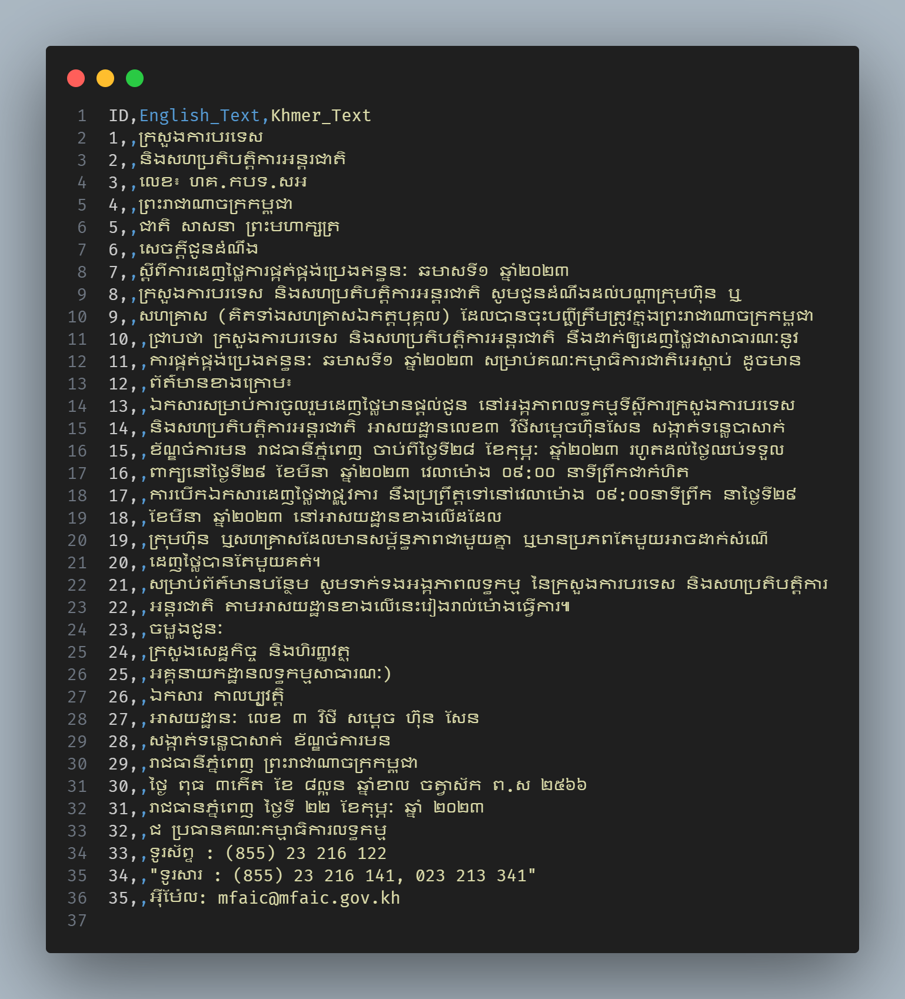

# PDF Downloader and OCR Extractor

## Project Description

This project automates the extraction of text from online PDF files.  
It collects URLs ending with `.pdf`, downloads the PDFs to your local machine, and converts each page to images. The images are then sent to the Gemini API for OCR (Optical Character Recognition) using a specific prompt to receive the extracted data in a structured, easy-to-use format. The final results are saved into a CSV file for easy access and analysis.

**To ensure your computer remains stable during large processing jobs, the project uses `psutil` to monitor memory usage.** If RAM usage becomes too high, the process will automatically pause, clear up memory, and then continue—helping to prevent your machine from being killed due to excessive resource usage.

**Large PDFs are automatically skipped (configurable page limit) to further protect your resources.**  
The script processes each PDF page-by-page, never loading the entire document into memory at once.


> **Note:** Please use the `"gemini-1.5-flash"` model as it is especially strong for OCR in Khmer language.  
> It allows only 50 requests per day.

---

## Features

- **Download PDFs from user-provided URLs**
- **Converts PDF pages to images on the fly**
- **OCR extraction with Gemini API, supporting both English and Khmer text**
- **Results saved to a CSV file for further processing or analysis**
- **Automatic memory usage monitoring and protection**
- **Skips large PDFs that exceed your set page limit**
- **Simple command-line workflow**

---

## Sample and Results

<div align="center">
  <div style="display: flex; justify-content: center; gap: 20px; flex-wrap: wrap; max-width: 900px; margin: auto;">

  <div style="text-align: center;">
    <h3>Sample Input</h3>
    <embed 
        src="https://mfaic.gov.kh/files/uploads/0YS4PAUIQFCD/សេចក្តីជូនដំណឹង_ស្តីពីកាដេញថ្លៃការផ្គត់ផ្គង់ប្រងឥន្ធនៈ.pdf" 
        type="application/pdf" 
        width="400px" 
        height="500px"
        style="border: 1px solid #ddd; border-radius: 8px;"
    >

  </div>

  <div style="text-align: center;">
    <h3>OCR Result</h3>
    
  </div>

  </div>
</div>


---

## Requirements

- Python 3.12.3 
- [Poppler](https://github.com/oschwartz10612/poppler-windows) (for `pdf2image`; install via system package manager or as described in the pdf2image docs)

---

## Setup

1. **Clone the repository:**
    ```bash
    git clone https://github.com/Kheav-Kienghok/PdfOcrProcessor.git
    cd PdfOcrProcessor
    ```

2. **Install required packages:**
    ```bash
    pip install -r requirements.txt
    ```

3. **Install Poppler:**
    - **Windows:** [Download Poppler binaries](https://github.com/oschwartz10612/poppler-windows/releases/), unzip, and add the `bin` directory to your PATH.
    - **macOS (Homebrew):** `brew install poppler`
    - **Linux (Debian/Ubuntu):** `sudo apt-get install poppler-utils`

4. **Set up your API key:**
    - Create a `.env` file in the project root directory.
    - Add your Gemini API key:
      ```
      GENAI_API_KEY=your_api_key_here
      ```

---

## Usage

Run the script from your project directory:

```bash
python main.py
```

- You will be prompted to enter PDF URLs one by one (must end with `.pdf`).
- When you have entered all your URLs, press **Enter** on an empty line to start processing.
- The extracted text will be saved as a CSV file in the `output/` directory.

---

## Notes

- By default, PDFs with more than 20 pages are skipped to prevent heavy resource usage.
  - You can change this limit in the script if needed.
- Each page is processed individually for efficiency and safety.
- Make sure you have a valid Gemini API key with enough quota for your intended usage.
