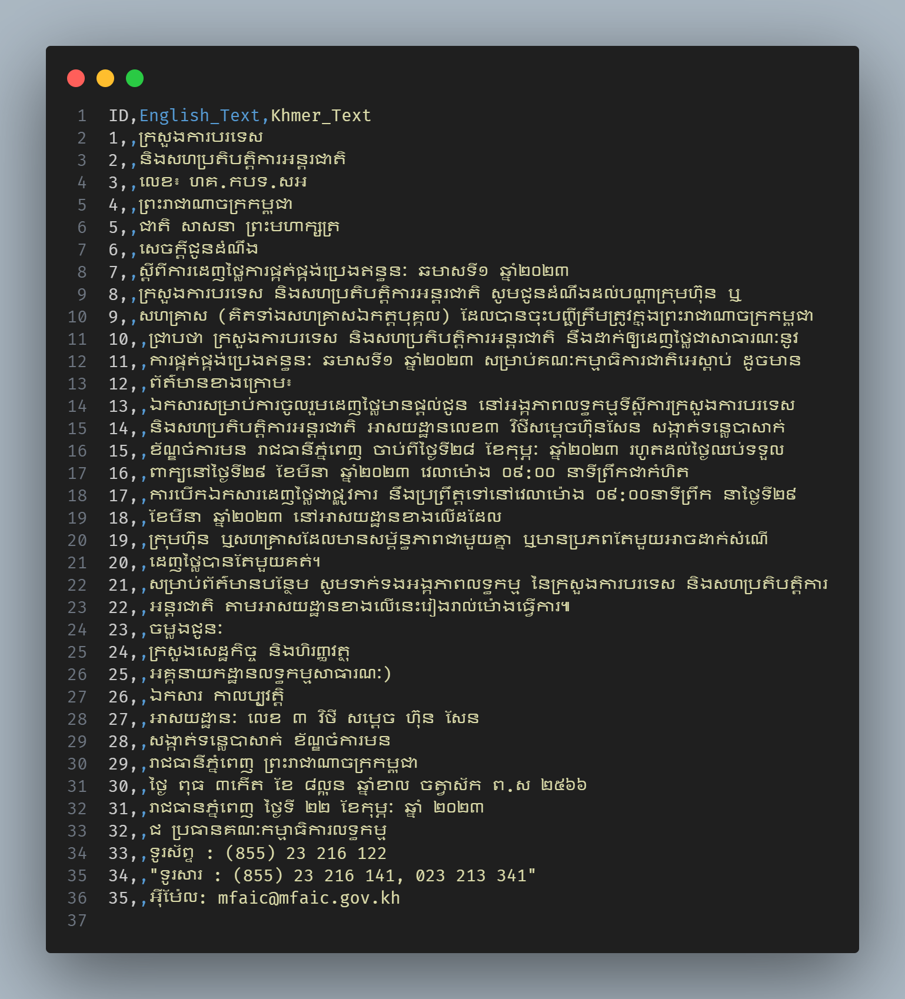
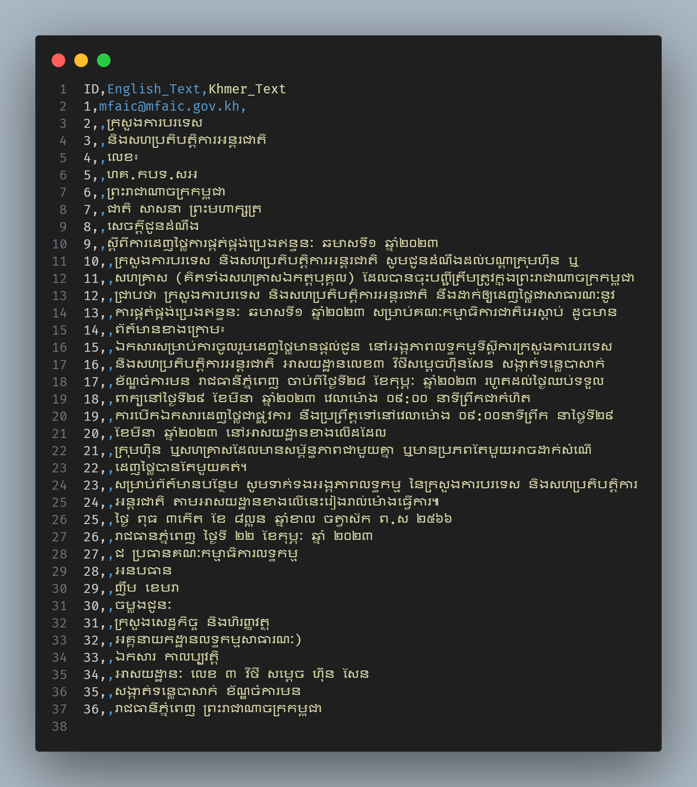

# 📄 PDF Downloader and OCR Extractor

## 🔍 Project Overview

This project automates the extraction of **Khmer** and **English** text from online PDF files using Google's **Gemini** models in a smart and efficient pipeline.

It uses a **two-stage model process** for language detection and text extraction:

### 1. **Detection Stage**  
A lightweight model (fallback between `gemini-2.5-pro` and `gemini-2.5-flash`) analyzes each PDF page (converted to an image) to determine if it contains:  
- **Khmer**  
- **English**  
- **Both**  
- or **None**  

This pre-check avoids wasting your **limited Gemini API quota** on irrelevant pages (e.g., Thai, Hindi, or empty pages).

### 2. **Extraction Stage**  
If a page contains Khmer or English, it is then passed to a high-accuracy OCR model—`gemini-1.5-flash` or `gemini-2.0-flash`—which extracts and organizes readable text into two clearly labeled sections:
- `English_Text:`
- `Khmer_Text:`

⚙️ *Note: The detection model only checks for language presence. The actual text extraction is always performed by the OCR model.*

To ensure stability, the script uses `psutil` to monitor RAM usage. If memory usage exceeds a defined threshold, the script will **pause automatically** to prevent system crashes.

Other safeguards include:
- Skipping PDFs with more than **20 pages** (default limit)
- Processing **one page at a time**, so memory usage stays minimal

> ⚠️ **Gemini OCR Quota Notes**  
> `gemini-1.5-flash` and `gemini-2.0-flash` are highly accurate for **Khmer OCR**, but they are limited on the free tier:  
> - `gemini-1.5-flash`: **50 requests/day**  
> - `gemini-2.0-flash`: **200 requests/day**  
>  
> Using a detection model first helps **reserve this limited quota** for meaningful content only.


---

## ✅ Features


- 🔗 Download PDFs from user-provided URLs  
- 📄 Convert PDF pages to images on-the-fly  
- 🤖 Dual-model fallback for language detection (`gemini-2.5-pro` primary, `gemini-2.5-flash` fallback)  
- 🔍 Extract Khmer and English text using Gemini OCR models  
- 📊 Visual progress bar with [`tqdm`](https://github.com/tqdm/tqdm) showing page processing progress  
- 💾 Monitor and manage system RAM with `psutil` to avoid crashes  
- 🚫 Skip PDFs exceeding 20 pages (configurable)  
- 🖥️ Interactive CLI with clear prompts and status updates  

---

## 📥 Sample Input (PDF)

[Click here to view the sample PDF](https://mfaic.gov.kh/files/uploads/0YS4PAUIQFCD/សេចក្តីជូនដំណឹង_ស្តីពីកាដេញថ្លៃការផ្គត់ផ្គង់ប្រងឥន្ធនៈ.pdf)

---

## 🧠 Gemini OCR Results (Comparison)

<div align="center">

<table>
  <tr>
    <th style="text-align: center;">Gemini 1.5 Flash</th>
    <th style="text-align: center;">Gemini 2.0 Flash</th>
  </tr>
  <tr>
    <td align="center">
      
    </td>
    <td align="center">
      
    </td>
  </tr>
</table>

</div>

---

## Notes on API Quotas 

- **Detection model fallback:**  
  If the primary detection model (`gemini-2.5-pro`) hits a quota limit or returns an error (such as HTTP 429), the system automatically falls back to the secondary model (`gemini-2.5-flash`) to maintain workflow continuity.

- **OCR quota limits:**  
  The OCR models (`gemini-1.5-flash`, `gemini-2.0-flash`) have daily limits on the number of requests you can make, depending on your API plan. Exceeding these limits will halt processing until the quota resets.

- **Efficient quota usage:**  
  Using a lightweight detection step before OCR extraction significantly reduces unnecessary OCR requests on pages without relevant text, thus optimizing quota usage and saving costs.

- **Monitoring and handling rate limits:**  
  The script includes error handling to detect quota exhaustion and stops processing gracefully, saving all progress to CSV before exiting.

- **Recommendation:**  
  For large-scale or frequent use, consider upgrading your Gemini API plan or implementing batching strategies to stay within quota limits.


## Requirements

- Python 3.12.3 
- [Poppler](https://github.com/oschwartz10612/poppler-windows) (for `pdf2image`; install via system package manager or as described in the pdf2image docs)

---

## Setup

1. **Clone the repository:**
    ```bash
    git clone https://github.com/Kheav-Kienghok/PdfOcrProcessor.git
    cd PdfOcrProcessor
    ```

2. **Install required packages:**
    ```bash
    pip install -r requirements.txt
    ```

3. **Install Poppler:**
    - **Windows:** [Download Poppler binaries](https://github.com/oschwartz10612/poppler-windows/releases/), unzip, and add the `bin` directory to your PATH.
    - **macOS (Homebrew):** `brew install poppler`
    - **Linux (Debian/Ubuntu):** `sudo apt-get install poppler-utils`

4. **Set up your API key:**
    - Create a `.env` file in the project root directory.
    - Add your Gemini API key:
      ```
      GENAI_API_KEY=your_api_key_here
      ```
---

## Usage

Run the script from your project directory:

```bash
python main.py
```

- You will be prompted to enter PDF URLs one by one (must end with `.pdf`).
- When you have entered all your URLs, press **Enter** on an empty line to start processing.
- The extracted text will be saved as a CSV file in the `output/` directory.

### 🔧 Optional Arguments

| Argument    | Description                                                  | Example                              |
|-------------|--------------------------------------------------------------|--------------------------------------|
| `--model`   | Specify Gemini OCR model (`gemini-1.5-flash` or `gemini-2.0-flash`) | `--model gemini-2.0-flash`           |

---

### 📌 Examples

```bash
# Use default model (gemini-1.5-flash)
python main.py

# Use Gemini 2.0 Flash model
python main.py --model gemini-2.0-flash
```

---

## 🔧 API Configuration

### Getting a Gemini API Key

1. Visit [Google AI Studio](https://aistudio.google.com/)
2. Sign in with your Google account
3. Navigate to "Get API Key" section
4. Create a new API key
5. Copy the key and add it to your `.env` file

---

This project combines robust API usage with helpful UX improvements like RAM checks and progress visualization, making it ideal for reliable Khmer/English OCR extraction from PDFs.

